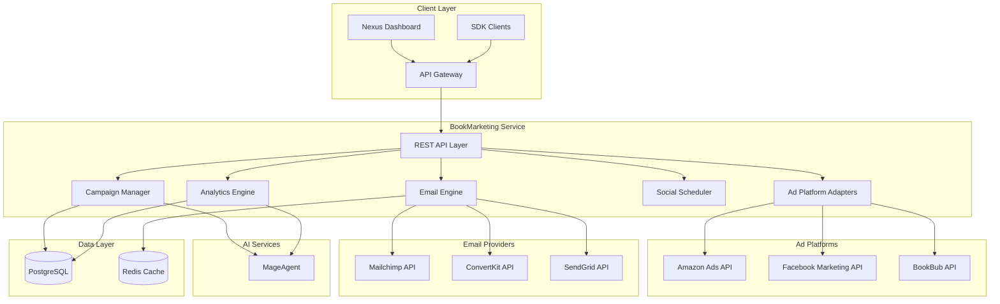
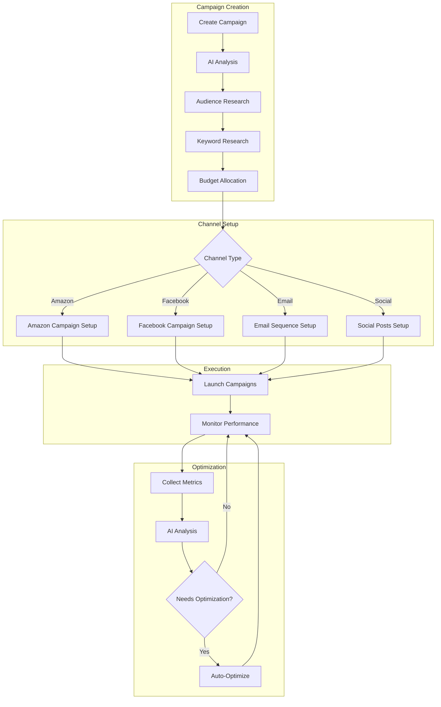
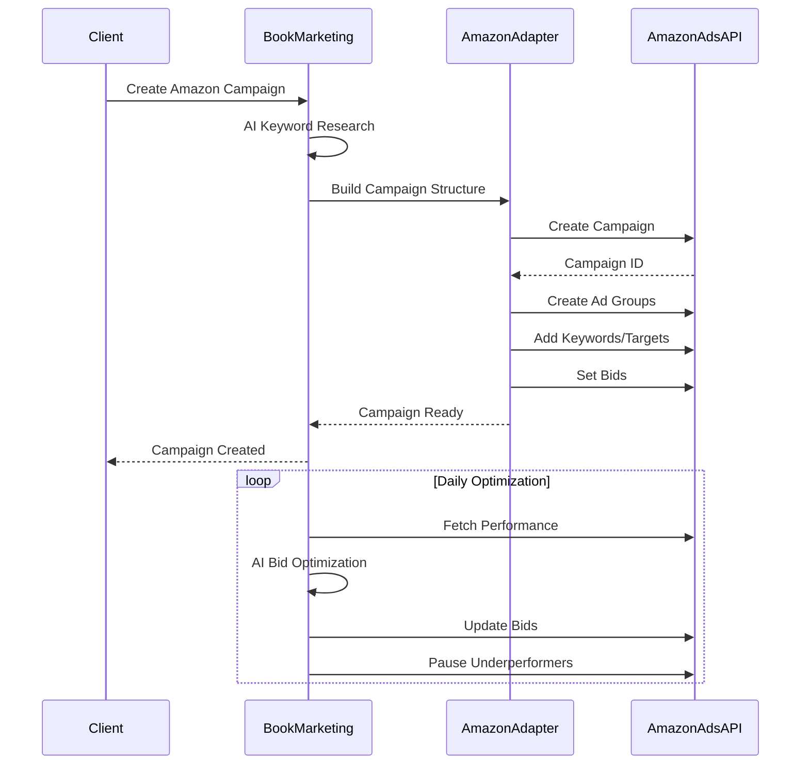
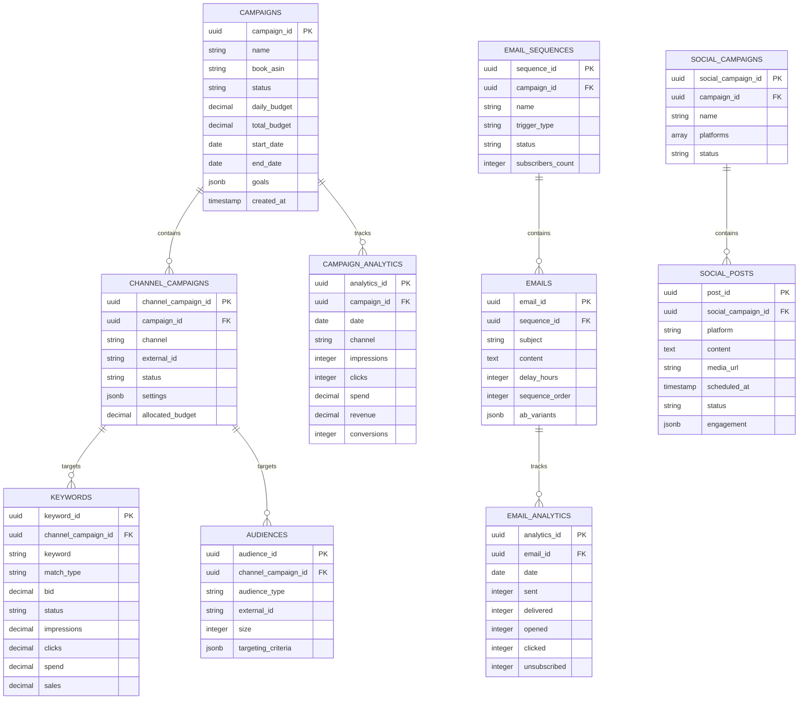
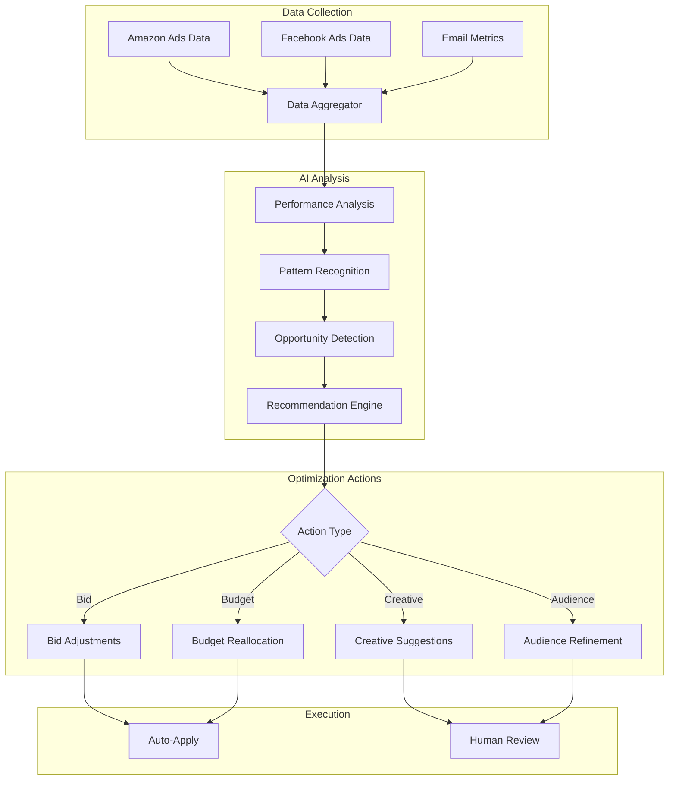
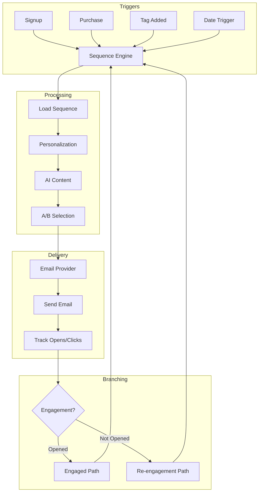

# BookMarketing Architecture

Technical architecture and system design for AI-powered book marketing automation.

---

## System Overview



---

## Core Components

### 1. REST API Layer

| Endpoint | Method | Description |
|----------|--------|-------------|
| `/marketing/api/campaigns` | POST | Create marketing campaign |
| `/marketing/api/campaigns/:id` | GET | Get campaign details |
| `/marketing/api/campaigns/:id/analytics` | GET | Get campaign analytics |
| `/marketing/api/campaigns/:id/pause` | PUT | Pause campaign |
| `/marketing/api/ads/amazon` | POST | Create Amazon Ads campaign |
| `/marketing/api/ads/facebook` | POST | Create Facebook campaign |
| `/marketing/api/ads/bookbub/featured-deal` | POST | Apply for BookBub Featured Deal |
| `/marketing/api/email/sequences` | POST | Create email sequence |
| `/marketing/api/social/campaigns` | POST | Schedule social campaign |
| `/marketing/api/analytics/dashboard/:projectId` | GET | Get dashboard data |

### 2. Campaign Manager

Orchestrates multi-channel marketing campaigns.

**Capabilities:**
- Campaign creation and lifecycle management
- Budget allocation across channels
- Goal tracking and optimization triggers
- A/B test management

### 3. Ad Platform Adapters

Unified interface to advertising platforms.

**Supported Platforms:**
- Amazon Advertising API (Sponsored Products, Brands, Display)
- Facebook Marketing API (Ads, Custom Audiences, Lookalikes)
- BookBub Partners API (Featured Deals, Ads)
- NetGalley API (Review copies)

### 4. Email Engine

Email marketing automation with AI personalization.

**Features:**
- Sequence builder with branching logic
- A/B testing for subject lines and content
- Behavior-based triggers
- List segmentation and hygiene

### 5. Social Scheduler

Cross-platform social media management.

**Platforms:**
- Twitter/X
- Instagram
- Facebook Pages
- TikTok
- Pinterest

### 6. Analytics Engine

Unified reporting across all marketing channels.

**Features:**
- Real-time performance dashboards
- Multi-touch attribution modeling
- ROI calculation and forecasting
- AI-powered recommendations

---

## Campaign Flow Architecture



---

## Amazon Ads Integration



---

## Data Model



---

## AI Optimization Pipeline



---

## Email Automation Engine



---

## Security Model

### Authentication
- Bearer token via Nexus API Gateway
- OAuth 2.0 for ad platform connections
- API key rotation for third-party services

### Authorization
- Campaign-level access control
- Role-based permissions (Owner, Manager, Viewer)
- Ad account connection scoping

### Data Protection
- Credentials encrypted at rest (AES-256)
- No storage of ad platform passwords
- Audit logging for all campaign actions

---

## Deployment Architecture

### Kubernetes Configuration

```yaml
apiVersion: apps/v1
kind: Deployment
metadata:
  name: nexus-bookmarketing
  namespace: nexus-plugins
spec:
  replicas: 3
  selector:
    matchLabels:
      app: nexus-bookmarketing
  template:
    spec:
      containers:
      - name: bookmarketing-api
        image: adverant/nexus-bookmarketing:1.0.0
        ports:
        - containerPort: 8080
        resources:
          requests:
            memory: "1Gi"
            cpu: "500m"
          limits:
            memory: "2Gi"
            cpu: "1000m"
        env:
        - name: AMAZON_ADS_CLIENT_ID
          valueFrom:
            secretKeyRef:
              name: bookmarketing-secrets
              key: amazon-client-id
        - name: FACEBOOK_APP_ID
          valueFrom:
            secretKeyRef:
              name: bookmarketing-secrets
              key: facebook-app-id
        livenessProbe:
          httpGet:
            path: /marketing/api/health/live
            port: 8080
        readinessProbe:
          httpGet:
            path: /marketing/api/health/ready
            port: 8080
```

### Resource Allocation

| Component | CPU | Memory | Storage |
|-----------|-----|--------|---------|
| API Server | 500m-1000m | 1Gi-2Gi | - |
| Analytics Worker | 1000m-2000m | 2Gi-4Gi | 20Gi |
| Email Worker | 250m-500m | 512Mi-1Gi | 5Gi |
| Social Worker | 250m-500m | 512Mi-1Gi | 5Gi |

---

## Performance

### Processing Capacity

| Tier | Campaigns | Daily Syncs | Analytics Updates |
|------|-----------|-------------|-------------------|
| Starter | 2 | 2 | Every 6 hours |
| Author | 10 | 4 | Every 2 hours |
| Pro Publisher | 50 | 12 | Every 30 min |
| Enterprise | Unlimited | 24 | Real-time |

### Latency Targets

| Operation | Target |
|-----------|--------|
| Campaign Creation | < 5s |
| Analytics Fetch | < 2s |
| Bid Optimization | < 30s |
| Email Send | < 1s |
| Report Generation | < 60s |

---

## Monitoring

### Metrics (Prometheus)

```
# Campaign metrics
bookmarketing_campaigns_active_total
bookmarketing_ad_spend_total
bookmarketing_revenue_total
bookmarketing_roas_gauge

# Platform metrics
bookmarketing_amazon_api_latency
bookmarketing_facebook_api_latency
bookmarketing_email_delivery_rate

# Optimization metrics
bookmarketing_optimizations_applied_total
bookmarketing_bid_changes_total
```

### Alerting

| Alert | Condition | Severity |
|-------|-----------|----------|
| API Connection Failed | Platform unreachable > 5 min | Critical |
| ROAS Below Threshold | Campaign ROAS < 1.5 | Warning |
| Email Bounce Rate High | Bounce rate > 5% | Warning |
| Budget Overspend | Daily spend > 120% budget | Critical |

---

## Next Steps

- [Quick Start Guide](./QUICKSTART.md) - Get started quickly
- [Use Cases](./USE-CASES.md) - Marketing strategies
- [API Reference](./docs/api-reference/endpoints.md) - Complete docs

